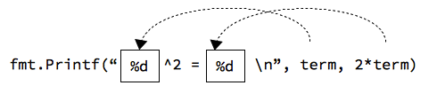

# Анхны Go програм

Аль ч компютерийн хэл нь компютер болон програм зохиогчийн хооронд "гүүр" болох зориулалттай байдаг. Програм зохиогч өөрийн санааг текст засварлагч дээр бичиж файлд хадгална, энэ файлыг _эх файл_ гэнэ. Эх файлыг Go хөрвүүлэгчээр машины код уруу хувиргана. Ингээд компютер түүнийг ойлгож ажиллуулна.

Хамгийн анхны жишээ болгон Hello World програм бичиж үзэцгээе.

```go
package main
import "fmt"

// анхны програм
func main() {
    fmt.Println("Hello, World!")
}
```

**Алхам-1**. Дээрх эх кодыг текст засварлагч дээр бичээд `hello.go` нэртэй файл болгон хадгална. Код бичихэд ердийн Notepad, Sublime, Atom зэрэг текст засварлагч ашиглаж болох боловч Visual Studio Code нь илүү өргөн боломжийг олгодог.

Програмын эх кодыг диск төхөөрөмж дээр тодорхой хавтсанд цэгцтэй хадгалвал тохиромжтой байдаг. Жишээ нь `src` нэртэй хавтсанд бүх програмаа хадгалж болох юм. Ингээд эх файлаа дотор нь хадгалах хэрэгтэй.

**Алхам-2**. Одоо эх кодоо машины хэл рүү хөрвүүлэх хэрэгтэй. Учир нь дээрх Go хэл дээр бичсэн кодыг машин ойлгохгүй.

```sh
$ go build hello.go
```

Програм амжилттай хөрвүүлэгдсэн бол `hello` (Windows дээр hello.exe) нэртэй файл үүссэн байх болно.

Хөрвүүлэлтийн дотоод процессыг дэлгэрэнгүй харахыг хүсвэл `go build` команд дээр `-x` параметрийг нэмж ажиллуулах хэрэгтэй.

Go хөрвүүлэгчээс үүссэн машины кодон дотор програмыг ажиллахад дэмжлэг үзүүлэх, санах ойг удирдах, чөлөөлөх нэмэлт код орсон байдаг. Тиймээс голдуу том хэмжээтэй машины код үүсдэг.

Мөн ямар үйлдлийн систем дээр ажиллаж байгаагаас үл хамааран Go хөрвүүлэгчээр өөр өөр үйлдлийн системд зориулсан програм үүсгэх боломжтой.

```sh
$ GOOS=linux go build hello.go
$ GOOS=windows go build hello.go
$ GOOS=darwing go build hello.go
```

**Алхам-3**. Хөрвүүлээд програм маань бэлэн болсон учраас дараах байдлаар ажиллуулж болно.

Linux, Unix, Mac OSX төрлийн үйлдлийн систем дээр:

```sh
$ ./hello
```

Windows  дээр:

```sh
C:\> hello.exe
```

гэж бичээд ENTER товч дарна.

Програмын үр дүнд дэлгэц дээр "Hello World" гэсэн мэдэгдэл хэвлэгдэх ёстой.


# Програмын үндсэн элементүүд

Барилга барихад тоосго, мод, шил гэх мэт үндсэн элементүүд хэрэглэхтэй адил програм нь хувьсагч, илэрхийлэл, заавар, функц, тайлбар зэрэг үндсэн элементүүдээс бүтдэг. 


# fmt функцүүд

Дэлгэц ба гар нь компютерт мэдээллийг оруулах, гаргах үндсэн төхөөрөмжүүд бөгөөд эдгээрийг стандарт оролт/гаралт гэж хэлдэг.

## Мэдээлэл хэвлэх

Програмын үр дүнг дэлгэц дээр харуулахад `print`, `println` болон `fmt.Printf` функцүүдийг ашиглаж болно.

```go
// println нь текст мөрийн араас '\n' тэмдэгтийг оруулж хэвлэдэг.
println("Hello World!")
```

`fmt.Printf` функц нь мэдээллийг тодорхой форматтайгаар дэлгэцэнд гаргахад ашиглагддаг. Ерөнхий хэлбэр нь дараах байдалтай:

```go
fmt.Printf(format, expression-1, expression-2, ...)
```
Хэлбэршүүлэгч `format` нь юуг, яаж хэвлэхийг заана. `expression-1`, `expression-2` нь хэвлэгдэх илэрхийллүүд байна.

```go
var term int = 15;
fmt.Printf("%d^2 = %d\n", term, 2 * term)
```
Дээрх кодын хэсэг нь дэлгэц  дээр `15^2 = 30` гэсэн мэдээллийг хэвлэнэ. Энд `%d` тэмдэгтийг орлуулагч тэмдэгт гэнэ. Функцийн эхний параметрт бичигдсэн мөр нь нэг бүрчлэн хэвлэгдэнэ. Гэхдээ энд орлуулагч ашигласан учраас `term` хувьсагчийн утга нь эхний `%d`-н байранд, `2 * term`  утга нь дараагийн `%d` байранд гэх мэт орлуулагдан хэвлэгдэнэ.



## Өгөгдөл оруулах

`fmt.Scanf` функцийг өгөгдөл оруулахад ашиглаж болно. Энэ функц нь `Printf`-тэй адилхан зарчмаар ажилладаг, ялгаа нь өгөгдөл оруулна.

```go
fmt.Scanf(format, &variable1, &variable2 . . .)
```

`format` нь `Printf` функцийн хэлбэршүүлэгчтэй төстэй. Хувьсагчдын нэрний өмнө амперсанд `&` тэмдэгт тавих хэрэгтэй. Энэ нь хувсагчдын утгыг өөрчлөх боломжийг олгоно.

Дараах жишээнд `Scanf` функцийг ашиглан тоон өгөгдөл оруулж байна.

```go
package main
import "fmt"

func main() {
    var value int // хувьсагч зарлах

    fmt.Print("Утга оруул: ")
    fmt.Scanf("%d", &value)

    fmt.Printf("%d * 2 = %d\n", value, value * 2)
}
```

Энэ програм нь гараас оруулсан тоог 2-оор үржүүлж үр дүнг хэвлэнэ.

Програмыг ажиллуулвал дараах байдалтай харагдана:

```sh
Утга оруул: 12
12 * 2 = 24
```

Хэрэв `“Утга оруул:”` гэхийг `“Утга оруул\n:”` гэж соливол (ард нь шинэ мөрийн `\n` тэмдэгт нэмсэн) үр дүн дараах байдалтай болно:

```sh
Утга оруул:
12
12 * 2 = 24
```
