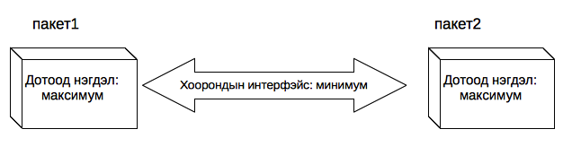

# Пакет, модул

Энэ хүртэл бид багахан хэмжээний, зөвхөн ганц эх файлтай програм бичиж байсан. Програмын хэмжээ өсөж том болохын хэрээр түүнийг олон файл, пакетад хуваах хэрэгтэй болдог. Програмыг олон файлд хувааж, тус тусад нь хөгжүүлэн дараа нь нэг програм руу нийлүүлэх нь оновчтой байдаг. Ингэхдээ холбоо хамааралтай кодууд буюу файлуудыг нэг пакетад байрлуулах нь зүйтэй. Жишээ нь, нэг пакет нь өгөгдөл дээр хайлт, эрэмбэлэлт хийдэг байхад нөгөө нь комплекс тоо боловсруулах кодууд агуулж болно.

Програмыг олон пакетад хуваах нь мөн хүмүүст ажил хувиарлах нэг тохиромжтой арга юм. Програм томрохын хэрээр олон програм зохиогч оролцох хэрэгтэй болдог. Энэ үед програм зохиогч болгонд нэг нэг пакетыг хувиарлаж болно. Ингэснээр програм зохиогч бүр өөрийн пакетын дотоод зохиомжид илүү анхаарч ажиллана.

Жишээлбэл дараах бүтэцтэй проект байг:

```plaintext
root/
├── go.mod
├── greetings/
│   └── greetings.go
└── cmd/
    └── main.go
```

Энэ програм нь `greetings` болон `cmd` дэд хавтасуудад хуваагдаж зохион байгуулагдсан байна.

## Пакет

Go файл нь ямар нэг пакетад харъяалагдах ёстой. Пакетын нэрийг файлын эхний мөрөнд бичдэг. Пакетын нэр нь ихэвчлэн хавтасны нэртэйгээ адил байдаг.

Жишээ нь `greetings.go` файл нь `greatings` пакетад хамаарах бөгөөд дараах байдалтай харагдана:

```go
package greetings

import "fmt"

func Hello(name string) string {
    return fmt.Sprintf("Hello %v !", name)
}
```

Хамгийн түгээмэл пакет бол бидний сайн мэдэх `main` пакет юм. Ажиллуулах боломжтой Go програм бүр заавал нэг `main` нэртэй пакеттай байдаг. Харин сан байдлаар ашиглагдах кодын хувьд `main` пакет шаардлагагүй.

```go
  package main
 ```

## Модул

Модул нь хамтад нь багцалсан пакетуудын олонлог юм. Модулын тодорхойлолтыг `go.mod` файлд бичиж толгой хавтаст байрлуулдаг. Энэ файлд модулын нэр, дугаар буюу хувилбар, бусад хамаарал зэргийг бичнэ. 

`go.mod` файлын агуулга:
```plaintext
module example.com/mymodule

go 1.21
```

Энэ жишээнд модулын нэр нь `example.com/mymodule` бөгөөд Go 1.21 хувилбарыг ашиглана гэдгийг тодорхойлсон байна. 

Ингээд `main.go` файлд (main пакетад хамаарах) `greetings` пакетыг дараах байдлаар импортлож болно:

```go
package main

import (
	"fmt"

	"example.com/mymodule/greetings"
)

func main() {
	message := greetings.Hello("World!")
	fmt.Println(message)
}
```

## Пакетыг нэрлэх

Пакетын зохиомж хийх үед нэр сонгох, зөв нэрлэх нь маш чухал байдаг. Нэрийг эхэндээ зөв онооход хэцүү байдаг. Тодорхой хугацааны дараа програм бүрэлдэх явцад програмын хэсгүүд, тэдгээрийн уялдааг сайн гаргасны дараа илүү оносон нэр өгөх нь олонтаа байдаг. Таны сонгосон нэр нь та кодынхоо талаар ямар бодолтой байгааг илэрхийлж байдаг учраас нэр сонгохдоо анхаарах хэрэгтэй.

Пакетыг интернэтэд байрлуулах бол модул үүсгэх бөгөөд модул болон пакет нийлсэн бүтэн зам нь чухал байдаг. Бүтэн замыг бусад пакеттай үл давхардахаар бодож сонгох хэрэгтэй. 

Жишээлбэл `greetings` пакетын бүтэн зам нь `example.com/hello/greetings` байж болно.

Ерөнхийдөө замын сүүлийн хэсэг нь ихэвчлэн пакетын нэр байдаг. Энэ нь хатуу дүрэм биш боловч дагавал зохих дүрэм юм. Хэрэв `foo/bar` замтай боловч `quux` нэртэй пакет байвал хөгжүүлэгчийг төөрөгдүүлэх болно.

## Пакетын зохиомж

Пакетын зохиомж хийх үед мэдээллийн урсгалыг анхаарах хэрэгтэй. Мэдээллийн урсгал нь пакетын зохиомж эхлэхээс өмнө сайтар судлагдсан байх ёстой. Ямар мэдээлэл ашиглагдаж байна, мэдээлэл дээр ямар боловсруулалт хийгдэж байна гэдгийг олж харах нь чухал байдаг.

Пакетын сайн зохиомж хийхэд дараах 2 зүйлийг анхаарах хэрэгтэй:

* Өгөгдлийн далдлалт (пакетын дотор):  
  Пакет дахь дотоод функцүүдийн уялдаа холбоо сайн байх хэрэгтэй. Пакет дотор аль болох хоорондоо холбоотой зүйлс байрлуулах хэрэгтэй. Хэрэв тухайн пакетэд хамаарал багатай зүйл бол өөр пакет руу шилжүүлэх хэрэгтэй.

* Цомхон интерфэйс (пакетын гадна)  
  Пакетын интерфэйс цомхон байх хэрэгтэй. Өөрөөр хэлбэл пакетын гаднаас ашиглаж болох нээлттэй функц, хувьсагчдын тоо цөөн байх хэрэгтэй. Цомхон интерфэйс нь энгийн байдаг, мөн турших, ашиглах, арчлахад хялбар, асуудал, алдаа багатай байдаг.



Өгөгдлийн далдлалт, интерфэйсийн зохиомж нь хоёулаа сайн пакет зохиох гол түлхүүр байдаг.

Энэ хоёр ухагдахууныг ойлгуулах зорилгоор кофе шоп ба үйлчлүүлэгчийн жишээ авая. Үйлчлүүлэгч арын гал тогоонд юу болох, яаж кофе чанах талаар мэдэхгүй. Тэдгээрийн хооронд ямар нэг харилцаа байхгүй, үйлчлэгч тэдний хооронд зуучлана. Объект хандлагат ертөнцөд тэд бие биенээ олж харахгүй. Тодорхой “үүдээр” тэд кофе болон мөнгөө солилцоно.

Энэ далдлалт нь үйлчлүүлэгчид тааламжтай байх болно. Үйлчлүүлэгч кофе чанах процесст санаа тавихгүй. Үйлчлэгч ч мөн адил. Энэ харилцаа нь гал тогоо орвонгоороо дахин шинэчилэгдсэн ч, үйлчлэгч өөрөө кофегоо чанадаг байсан ч хэвээр үлдэх болно. Үйлчлүүлэгч энэ өөрчлөлтийг мэдэхгүй, мэдэх ч шаардлагагүй. Харин “үүд” буюу "кофе захиалах болон мөнгөө төлөх протокол" нь урьдын хэвээр байх хэрэгтэй. Энэ нь өгөгдлийн далдлалт, интерфэйсийн ач холбогдлыг харуулж байна.

## Пакетын дотор

Пакетад хамаарах бүх функц, обектуудыг нэг файлд “овоолох” хэрэггүй. Үүний оронд олон жижиг go файлууд үүсгэж болно. Тэдгээр файлуудын эхний мөрөнд ижил пакетын нэр зааснаар (`package` түлхүүр үгээр) ижил пакетад харяалагдана гэдгийг илэрхийлнэ. Файлуудыг хөрвүүлэх үед хөрвүүлэгч ижил толгойтой файлуудыг цуглуулж нэг машины кодонд хөрвүүлдэг.

Цөөн тохиолдолд эсрэгээр байх нь ч бий. Тухайлбал `main` пакет байна. `main` пакет ихэвчлэн том хэмжээтэй байдаг. Програмын гол командууд `main` пакетад байрлах ба тэдгээрийг гаднаас ашиглах шаардлага төдийлөн гарахгүй, тийм учраас зүгээр `main` пакет дотор оруулсан нь энгийн байдаг.

Пакетын дотоод зохиомжийн талаар сайн судлая гэвэл Go хэлний стандарт сангуудын эх кодыг үзэх хэрэгтэй. Зарим пакет нь их том, зарим нь жижиг байгаа. Жишээлбэл `http` пакет 17 go файлтай, 109 нэр (тогтмол, хувьсагч, төрөл, функц зэргийн нэр) экспортлодог байхад `hash` пакет 1 файлтай, 3 нэр экспортлодог.

## Пакетын гадна

Нэр том үсгээр эхэлсэн бол тухайн нэрийн дор буй обект (функц, хувьсагч г.м) пакетын гадна талаас ашиглах боломжтой болдог. Үүнийг өөрөөр _экспортлох_ гэж нэрлэдэг. Жижиг үсгээр эхэлсэн нэртэй обектууд пакетын гаднаас харагдахгүй, гэхдээ пакет дотроо ашиглах боломжтой байдаг.

Экспорт хийсэн обектыг өөр пакет дотор ашиглахдаа пакетын нэрийн ард цэг (.) тавьдаг. Жишээ нь `greetings` пакет доторх `Hello` функцэд хандах бол `greetings.Hello` гэж бичнэ. Хэрэв өөр нэг `hello` пакет дотор мөн ижил `Hello` нэртэй обект байсан бол `hello.Hello` гэж бичнэ. Эндээс пакет нь мөн нэр давхардах асуудлыг шийдэж байгаа нь харагдаж байна. Өөрөөр хэлбэл бусад C\#, Java гэх мэт програмчлалын хэлэнд байдаг нэймспэйсийн үүрэгтэй адил байна.