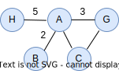

## Граф

Граф нь орой болон ирмэгээс тогтох олонлог юм. Ирмэг бүр хоёр оройг холбоно.

Бидний эргэн тойронд маш олон граф байдаг. Граф бүтцийг сүлжээ болон траффик судлах, зам маршрут тооцоолох, хүмүүсийн харилцаа холбоо судлах, мэдлэгийн сан бүрдүүлэх, халдварт өвчний тархалт судлах, удамшил генийн судалгаа хийх зэрэг маш олон төрлийн асуудал шийдвэрлэхэд ашигладаг.

| Граф | Орой | Ирмэг |
| --- | --- | --- |
| Компютерийн сүлжээ | Компютер, төхөөрөмжүүд | Кабел утас |
| Интернэт | Вэб хуудас | Гипер холбоос |
| Санхүү | Данс | Гүйлгээ |
| Ус суваг | Худаг, орон сууц | Дамжуулах хоолой |
| Нийгэм | Хүмүүс | Найз, нөхөрлөл, харилцаа |
| Автобус маршрут | Зогсоол | Тээврийн чиглэл, зам |

Граф бүтцийг майп, жагсаалт, слайс гэх мэт бидний өмнө үзсэн өгөгдлийн бүтцүүдийг ашиглан зохион байгуулж болно.

Жишээ болгон дараах графыг давхар майп ашиглан үүсгэе.



```go
package main

import (
  "bytes"
  "fmt"
)

// граф бүтэц
type Graph struct {
    data map[string]map[string]int
}

func NewGraph() *Graph {
    g := &Graph{}
    g.data = make(map[string]map[string]int)
    return g
}

// оройн жагсаалт
func (g *Graph) V() []string {
    var v []string
    for k, _ := range g.data {
        v = append(v, k)
    }
    return v
}

// ирмэг нэмэх
func (g *Graph) addEdge(source, target string, weight int) {
    map2, ok := g.data[source]
    if !ok {
        map2 = make(map[string]int)
    }
    map2[target] = weight
    g.data[source] = map2
}

// графыг хэвлэх
func (g *Graph) String() string {
    var strBuf bytes.Buffer
    for k, map2 := range g.data {
        strBuf.WriteString(k + "\n")
        for k2, w := range map2 {
          strBuf.WriteString(fmt.Sprintf("-%s-%d\n", k2, w))
        }
    }
    return strBuf.String()
}

func main() {
    g := NewGraph()
    g.addEdge("A", "B", 2)
    g.addEdge("A", "C", 0)
    g.addEdge("A", "G", 3)
    g.addEdge("A", "H", 5)
    g.addEdge("B", "A", 2)
    g.addEdge("C", "A", 0)
    g.addEdge("C", "G", 0)
    g.addEdge("G", "A", 3)
    g.addEdge("G", "C", 0)
    g.addEdge("H", "A", 5)

    fmt.Println(g)
}
```

### Гүнээс эхлэн гүйх (Depth-First Search)

```go
func DFS_AdjList(nodes []any, g [][]int, source int) {
	visited := make([]bool, len(g))
	stack := []int{source} // stack

	for len(stack) > 0 {
		u := stack[len(stack)-1]     // top
		stack = stack[:len(stack)-1] // pop

		if visited[u] {
			continue
		}

		fmt.Printf("at %v\n", nodes[u])
		visited[u] = true

		// add neighbors of 'u'
		stack = append(stack, g[u]...)
	}
}

func TestDFS_AdjList(t *testing.T) {
	nodes = []any{"n5", "n4", "n2", "n3", "n1", "n7"}     // nodes
	g = [][]int{{2, 1}, {4, 3, 0}, {5, 0}, {1}, {1}, {2}} // relations

	DFS_AdjList(nodes, g, 0)
}
```
        
### BFS

```go
func BFS_AdjList(nodes []any, g [][]int, source int) {
	visited := make([]bool, len(g))
	q := []int{source} // queue

	for len(q) > 0 {
		u := q[0] // get first
		q = q[1:] // cut the queue

		fmt.Printf("at %v\n", nodes[u])
		visited[u] = true

		// add neighbors of 'u'
		for _, v := range g[u] {
			if !visited[v] {
				q = append(q, v)
			}
		}
	}
}
```

## Мод

Мод нь графын нэг тусгай төрөл юм. Тиймээс графын ихэнхи алгоритмыг модон дээр хэрэглэж болно. 

Мод нь олон салаатай байж болох боловч компютерын шинжлэх ухаанд хоёртын мод буюу хоёр мөчиртэй модыг өргөн хэрэглэдэг. Учир нь ямар ч модыг хоёртын модонд хувирган дүрсэлж болно.

Модны нийтлэг шинжүүд нь:

* Мод нь нэг _үндэстэй_ байна
* Мөчиргүй зангилаа буюу төгсгөлийн зангилааг _навч_ гэнэ
* Модны үндэсээс нэг зангилаа хүртэлх замын уртыг тухайн _зангилааны гүн_ гэнэ. 
* Хамгийн гүн зангилаа нь _модны өндөрийг_ тодорхойлно.

Хоёртын модыг дараах байдлаар тодорхойлж болно. Хялбаршуулах үүднээс модны зангилаан дээрх утгыг бүхэл тоо байна гэж үзэв.

```go
// модны нэг зангилаа
type TreeNode struct {
    Value any        // зангилаан дээрх утга
	Left *TreeNode   // зүүн зангилаа
    Right *TreeNode  // баруун зангилаа
}
```

Мод үүсгэх

```go
root := &TreeNode{
    Value: "n5",
    Left: &TreeNode{
        Value: "n4",
        Left:  &TreeNode{Value: "n3"},
        Right: &TreeNode{Value: "n1"},
    },
    Right: &TreeNode{
        Value: "n2",
        Left:  &TreeNode{Value: "n7"},
        Right: nil,
    },
}
// Output:
//       n5
//       / \
//     n4   n2
//     / \   \
//   n3   n1  n7
```

### Модоор гүйх

Хоёртын модны бүх зангилаагаар дамжих хэд хэдэн арга бий. Модны үндсээс эхлээд гурван үйлдлийн сонголт бидэнд байна: тухайн зангилаан дээрх утгыг боловсруулах (D), зүүн зангилаагаар цаашлах (L), баруун зангилаагаар цаашлах (R). Эдгээр гурван үйлдлийн эрэмбээс хамаараад 3 хувилбар байж болно.

* DLR буюу PreOrder гүйх (графын DFS-тэй ижил)
* LDR буюу InOrder гүйх
* LRD буюу PostOrder гүйх


DLR буюу PreOrder гүйх:

```go
func PreOrder(node *TreeNode) {
    if node!=nil {
        fmt.Printf("%d ", node.Value)
        PreOrder(node.Left)
        PreOrder(node.Right)
    }
}
// Output: 5 4 3 1 2 7
```

LDR буюу InOrder гүйх:

```go
func InOrder(node *TreeNode) {
    if node!=nil {
        InOrder(node.Left)
        fmt.Printf("%d ", node.Value)
        InOrder(node.Right)
    }
}
// Output: 3 4 1 5 7 2
```

LRD буюу PostOrder гүйх:

```go
func PostOrder(node *TreeNode) {
    if node!=nil {
        PostOrder(node.Left)
        PostOrder(node.Right)
        fmt.Printf("%d ", node.Value)
    }
}
// Output: 3 1 4 7 2 5
```

Эдгээрээс гадна модны түвшин бүрээр гүйх өөр нэг хувилбар (LevelOrder) бий. Энэ нь графын BFS алгоритмаас санаа авсан арга юм.

```go
// Data from each level is being returned as a separate list
func LevelOrderTraversal(root *TreeNode) [][]string {
	if root == nil {
		return nil
	}

	var result [][]string // функцийн үр дүн
	queue := []*TreeNode{root} // үндэсийг дараалалд нэмэх

	for len(queue) > 0 {

        // нэг түвшний зангилаануудыг цуглуулах
		var levelValues []string
		for i := 0; i < len(queue); i++ {
			node := queue[0] // дарааллаас нэг зангилаа авах
            queue = queue[1:]

			levelValues = append(levelValues, node.Value)

			if node.Left != nil {
				queue = append(queue, node.Left)
			}
			if node.Right != nil {
				queue = append(queue, node.Right)
			}
		}

        // үр дүнд нэмэх
		result = append(result, levelValues)
	}
	return result
}
```


```go
result:=LevelOrderTraversal(root)
for level, nodes:=range result {
    fmt.Printf("Level %d, Nodes %v\n", level, nodes)
}
```