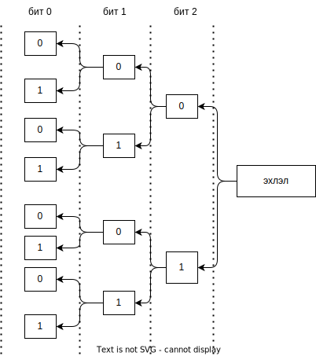

## Рекурсив функц (Recursion)

Өөрөө өөрийгөө шууд эсвэл шууд бусаар дууддаг функцийг _рекурсив_ функц гэнэ. Тооны факториал олох зэрэг рекурсив математик томъёололууд нь програмчлалын хэлэнд рекурсив функцээр шийдэгддэг.

Факториалын томъёо:

```
fact(0) = 1
fact(n) = n * fact(n-1)
```

Үүнийг код болгон буулгавал дараах байдалтай бичигдэнэ:

```go
func fact(number int) int {
  if number == 0 {
    return (1)
  }
  return number * fact(number-1)
}
```

Рекурсив функц нь дараах 2 үндсэн дүрмийг мөрдөх ёстой:

* рекурсив функц нь төгсдөг байх ёстой;
* асуудлыг энгийн болгох ёстой.

Дээрх `fact()` функц нь энэхүү 2 дүрмийг хангасан байна. Нэгд, `number == 0` болох төгсөх нөхцөлтэй байна.  Хоёрт, асуудлыг энгийнээр шийдсэн байна.

Факториал нь зөвхөн `number >= 0` үед бодогдоно. Хэрэв `fact(-3)`-г тооцоолохыг оролдвол юу болох вэ?  Стайк дүүрэлт болж програм хэвийн бус тасрах болно, учир нь  `fact(-3)` нь `fact(-4)`-г дуудна, цаашаа `fact(-5)`-г дуудна гэх мэт дуусахгүй үргэлжилнэ. Үүнийг _төгсгөлгүй рекурсийн алдаа_ гэж нэрлэдэг.


### Давталтыг рекурсив функцээр орлуулах
Давтаж тооцоолох олон зүйлсийг рекурсээр шийдэж болно. Жишээ нь, массивын элементүүдийг рекурсивээр нэмж нийлбэрийг олж болно. Нэмэх дүрмээ дараах байдлаар томёолж болно:

```math
sum(a) = 0				  , хэрэв len(a) = 0					
sum(a) = a[0]			  , хэрэв len(a) = 1
sum(a) = a[0] + sum(a[1:]), хэрэв len(a) > 1
```

Энэ функцийг код болгон хөрвүүлвэл:

```go
func sum(a []int) int {
  if len(a) == 0 {
    return 0
  }
  
  if len(a) == 1 {
    return a[0]
  }

  return a[0] + sum(a[1:])
}
```

`sum` функцэд `[1, 8, 3, 2]`  слайс дамжуулж ажиллуулах стайк дарааллыг доор харуулав:

```sh
sum([1, 8, 3, 2]) =
     1 + sum([8 3 2]) =
              8 + sum([3 2]) =
                       3 + sum([2]) =
                           2
                  5 = 3 + 2
         13 = 8 + 5 
14 = 1 + 13 

Хариу = 14
```

## Буцаж хайх (Backtracking)

Энэ нь боломжит бүх хувилбарыг шалгах замаар шийдэл хайх арга юм. Заримдаа бүх боломжийг шалгах нь хамгийн сайн алгоритм байдаг. Боломжит хувилбараас нэгийг сонгоод хайлт эхлүүлнэ, хэрэв зөв шийдэл олдвол цуглуулж авна, эсрэг тохиолдолд буцаж ухраад дараагийн хувилбарыг сонгон хайлтыг үргэлжүүлнэ. 

Буцаж хайх арга нь нэг төрлийн рекурсив функийн хэлбэр мөн. Ө.х олон хувилбараас нэгийг сонгоно, сонголт хийсний дараа дахин шинэ хувилбарууд үүснэ гэх мэтээр шийдэлд хүрэх хүртэл ижил зүйлийг давтан хийнэ. Хэрэв сонголтуудын дараалал зөв бол шийдэл олно, үгүй бол шийдэлд хүрэхгүй.

Энэ аргыг модны олон салаагаар дамжин хайлт хийж байна гэж төсөөлж болно. Модны үндэс нь эхлэлийн цэг болох ба модны навчнууд нь төгсгөл цэг болно. Модны бүх салааг шалгах нь удаан процесс болно. Үүнийг хурдасгах нэг арга нь илэрхий буруу салаануудыг шалгахгүйгээр хаях хэрэгтэй.  Буцаж хайх аргын сонирхолтой тал нь хэчнээн ч алхам буцаж сонголтоо өөрчилж болно. Бүр эхлэлийн цэг хүртэл буцаж болно, хэрэв бүх боломжийг шалгаж дуусаад эхлэлийн цэг дээр буцаж ирсэн бол тухайн асуудалд шийдэл байхгүй гэж үзэж болно.

Жишээ болгон `n` битэд хадгалж болох бүх бинари утгыг хэвлэж харуулая. Бинари тооны нэг битэд '0' эсвэл '1'-г хадгалж болно, энэ мэтээр бит бүрээр хоёр хувилбараас сонголт хийн үргэлжлүүлнэ.

```go
func printBinaryDigits(n int) {
	var backtrack func(digits []byte, i int)
	backtrack = func(digits []byte, i int) {
		// бит дууссан учраас нэг хувилбар олдсон гэж үзээд хэвлэх
		if i < 1 {
			digitsRev := slices.Clone(digits)
			slices.Reverse(digitsRev)
			fmt.Printf("%s\n", string(digitsRev))
			return
		}

		// эхний сонголт: 'i-1' бит дээр '0' утгыг сонгоод цааш үргэлжлэх
		digits[i-1] = '0'
		backtrack(digits, i-1)

		// энэ цэгт буцаж байна

		// дараагийн сонголт: 'i-1' бит дээр '1'-г сонгоод цааш үргэлжлэх
		digits[i-1] = '1'
		backtrack(digits, i-1)

		// энэ цэг дээр өмнөх бит рүү буцна
	}

	// эхлүүлэх
	digits := make([]byte, n)
	backtrack(digits, n)
}
```

Дээрх функцийг 3 бит дээр ажиллуулвал

```go
printBinaryDigits(3)
```
дараах үр дүнг хэвлэнэ:

```sh
000
001
010
011
100
101
110
111
```

Хайлтыг модоор дүрсэлж харуулвал дараах байдалтай байна.



## Сэлгэмэл, хэсэглэл

```go
func permuteRecursiveBacktrack(depth int, perm []byte, inPerm []bool, original []byte) {
	if depth == len(original) {
		println(string(perm))
	} else {
		for i := 0; i < len(original); i++ {
			// pick next un-used letter
			if !inPerm[i] {
				inPerm[i] = true
				perm[depth] = original[i]
				permuteRecursiveBacktrack(depth+1, perm, inPerm, original)
				inPerm[i] = false
			}
		}
	}
}
```


```go
func generateCombinations(arr []byte, k int) {

	var backtrack func(start int, combo []byte)
	backtrack = func(start int, combo []byte) {
		if len(combo) == k {
			println(string(combo))
			return
		}
		for i := start; i < len(arr); i++ {
			combo = append(combo, arr[i])
			backtrack(i+1, combo)
			combo = combo[:len(combo)-1]
		}
	}

	backtrack(0, []byte{})
}
```