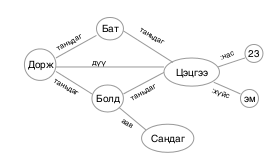

## Майп (map)

Компютер програмчлалд хамгийн чухал өгөгдлийн бүтцийн нэг бол майп юм. Майп нь өгөгдлийг хадгалахдаа түлхүүр оноож хадгалдаг. Майпыг заримдаа `Key-Value` (түлхүүр-утга) бүтэц гэж нэрлэдэг.

Майпын давуу тал нь түлхүүрийг мэдэж байгаа тохиолдолд өгөгдөлд хурдан хандах боломжтой байдаг. Өөрөөр хэлбэл хайлт хийх шаардлагагүй байдаг. Үүний цаана математик аргууд ашигладаг.

Майп обектыг дараах байдлаар зарлана:

```go
var colors map[string]int    // `colors` нь `nil` утгатай заагч үүснэ
colors = make(map[string]int) // make() функцээр санах ой хувиарлана
```
Энэ зарлалт нь `string` түлхүүртэй `int` утгын майп гэдгийг илэрхийлж байна.

Өөрөөр майпыг эхний утгатай үүсгэхдээ дараах бичиглэлийг ашиглаж болно.

```go
colors := map[string]int{
    "red": 0xFF0000,
    "green": 0x00FF00,
    "blue": 0x0000FF,
}
```

Майпад утга оноох эсвэл уншихдаа түлхүүрийг мэдэх хэрэгтэй.

```go
// "sky" түлхүүр дээр 0x00BFFF утга зоох
colors["sky"] = 0x00BFFF

// "sky" түлхүүрээр унших
c := colors["sky"]
```

Майпад заагдсан түлхүүр бүхий өгөгдөл бий эсэхийг дараах байдлаар шалгаж болно. 

```go
if val, exists := colors["sky"]; exists {
    // "sky" түлхүүрт утга байна
}
```
`sky` түлхүүрт харгалзах өгөгдөл байвал эхний `val` хувьсагчид хадгалагдана, мөн `exists` утга `true` болно, хэрэв байхгүй бол `val` хувьсагчид `0` утга оноогдож, `exists` хувьсагч нь `false` утгатай болно.


Майпын хэмжээг тодорхойлохдоо `len()` функцийг ашиглана.

```go
n := len(colors)
```

Майпаас элемент устгахдаа `delete()` функцийг ашиглана.

```go
delete(colors, "sky")
```

Майпын элементүүдээр давтах бол `range` үйлдлийг ашиглаж болно.

```go
for key, value := range colors {
    fmt.Println("Түлхүүр:", key, "Өгөгдөл:", value)
}
```


## Key-Value мэдээллийн сан

Key-value бүтэц нь өгөгдөл хадгалах хамгийн энгийн хэлбэрийн нэг юм. Бараг бүх програмчлалын хэлэнд key-value бүтэц байдаг, ихэвчлэн map, hash table, dictionary гэх мэтээр нэрлэдэг. Key-value бүтцийн цаана ихэвчлэн hash table, B-Tree, Red-black tree зэрэг алгоритм ашигладаг учраас өгөгдөл уншихад маш хурдан байдаг.

Key-value бүтцийн нийтлэг шинжүүд нь:

* `Set( key, value )`:  `value` утгыг `key` түлхүүрт харгалзуулан санах ойд хадгална, дараа нь энэ `key`-ээр дамжуулан өгөгдлийн олж болно. Хэрэв `key` түлхүүр өмнө нь байсан бол түүнийг дарж бичнэ.
* `Get( key )`: Өгөгдсөн `key`-д харгалзах өгөгдлийг уншина
* `Delete( key )`: `key`-д харгалзах өгөгдлийг устгана.

Жишээлбэл дараах өгөгдөл байна:

```
Өнгө      Мөнгөлөг
Хэмжээ    13"
Нэр       MacBook Air
```

Зүүн талд түлхүүр (key), баруун талд утга (value) байна. Утга хэсэгт текст, тоо зэрэг ямар ч төрлийн өгөгдөл байж болно.

Түлхүүр нь үл давхардах утга (ихэвчлэн тэмдэгт мөр) байх ёстой. Дээрх `Өнгө` гэсэн түлхүүр нь давхардах магадлал маш өндөр. Давхардлаас сэргийлэхийн тулд өмнө нь үг залгаж болно.

```
Key               Value
-----------------------------
laptop1_Өнгө      Мөнгөлөг
laptop1_Хэмжээ    13"
laptop1_Нэр       MacBook Air

laptop2_Өнгө      Цагаан
laptop2_Хэмжээ    14"
laptop2_Нэр       Acer
```

Түлхүүр зохиохдоо өгөгдлийн онцлогоо сайн бодож тооцоолох хэрэгтэй. Ерөнхийдөө аль болох богино, гэхдээ мэдээлэл агуулсан түлхүүр үүсгэхийг хичээх хэрэгтэй.

Түлхүүрийг нь мэдэж байгаа бол өгөгдлийг олж болно, харин түлхүүрийг мэдэхгүй эсвэл утга талбараар хайлт хийх шаардлагатай үед яах вэ гэсэн асуулт гарна.

Түлхүүрийг мэдэхгүй бол бүх мөрөөр давтах хэрэгтэй болно, ингэж давтах явцдаа утгуудыг шалгаад хэрэгтэй өгөгдлөө ялгаж авна. Гэхдээ энэ үйлдэл нь их хэмжээний өгөгдөл дээр маш удаан болно. Үүнийг өөр сагс үүсгэх замаар шийдэж болно. Өгөгдлийн сангийн системд үүнийг _индекс_ гэж нэрлэдэг. Энэ нь  өгөгдлийн тухай нэмэлт өгөгдөл үүсгэж ашиглана гэсэн санаа юм.

### Жишээ: Танилын сүлжээ

Дараах танилуудын мэдээлэл өгөгдсөн байна. Энэ мэдээллийг хадгалах, буцаан хайлт хийхэд зориулсан key-value бааз зохион байгуулая.



Атрибут холбоосыг ялгахын тулд урд нь `:` тэмдэг тавьсан байна. Жишээлбэл Цэцгээгийн `:нас`, `:хүйс` гэх мэт.

Зурагт харуулсан мэдээллийг key-value дүрслэлд ойртуулахын тулд дараах гурвалууд болгон хувааж болно.

| Subject (s) | Predicate (p) | Object (o) |
| --- | --- | --- |
| Бат | таньдаг | Дорж |
| Болд | таньдаг | Дорж |
| Цэцгээ | таньдаг | Болд |
| Цэцгээ | таньдаг | Бат |
| Дорж | дүү | Цэцгээ |
| Болд | аав | Сандаг |
| Цэцгээ | :нас | 23 |
| Цэцгээ | :хүйс | эм |

Ингээд `key=Subject|Predicate, value=Object` байдлаар сагс үүсгэж болно.

```go
dbRelation:=map[string]interface{
    "Бат|таньдаг": "Дорж",
    "Болд|таньдаг": "Дорж",
    "Цэцгээ|таньдаг": "Болд,Бат",
    "Дорж|дүү ": "Цэцгээ",
    "Болд|аав": "Сандаг",
    "Цэцгээ|:нас": 23,
    "Цэцгээ|:хүйс": "эм",
}
```

Одоо баазаас Цэцгээгийн таньдаг хүмүүсийг ялгаж харуулахад хялбархан.

```go
rel:=dbRelation["Цэцгээ|таньдаг"]
```

Хэрэв холбоосоор (`Predicate` талбараар) хайлт хийх бол анхны сагс тохиромжгүй болно. Тухайлбал ах, дүүгийн холбоотой хүмүүсийг олох бол бүх мөрөөр хайх хэрэгтэй болно. Үүнийг шийдэхийн тулд холбоос бүрээр шинэ сагсууд нэмж үүсгэж болно.

```go
dbFamily:=map[string]string{
    "Дорж|дүү":"Цэцгээ",
    "Болд|аав": "Сандаг",
}

dbKnows:=map[string]string{
    "Бат": "Дорж",
    "Болд": "Дорж",
    "Цэцгээ": "Болд, Бат",
}
```

Хайлтыг хөнгөвчлөх зорилгоор үүсгэж байгаа энэ сагсуудыг индекс гэж нэрлэж болно. Энэ мэтээр өгөгдлийн онцлогтоо тохируулан олон бааз, сагс, индекс зохион байгуулах замаар ямар ч мэдээллийг key-value баазад хадгалж болох юм.

Мөн `Predicate`, `Object` талбаруудаар хайлт хийхгүй, зөвхөн `Subject`-аар мэдээллийг хайх сагс хэрэгтэй бол `Predicate`, `Object` хэсгийг нь JSON текст бүтэцтэй болгон хадгалж болно.

```go
dbPerson:=map[string]string{
    "Цэцгээ": "{ \":нас\" :23, \":хүйс\": \"эм\" }"
}
```

Буцаан уншихдаа баазаас түлхүүрээр нь ("Цэцгээ") олоод JSON текстийг бүтэц рүү хувиргах юм.

Нэг мэдээллийг дагалдуулан олон туслах индекс, сагс үүсгэх нь өгөгдлийн давхардал үүсгэх, бичилтийн тоог нэмэгдүүлэх зэрэг дутагдалтай талууд бий. Гэхдээ бусад төрлийн баазууд ч үүнтэй ижил аргыг цаанаа ашиглаж байгаа. Ялгаатай нь бусад баазууд индексийг автоматаар зохицуулдаг бол key-value баазын хувьд хөгжүүлэгч өөрөө үүсгэх, засварлах шаардлагатай байдаг. Тухайлбал үндсэн сагсанд шинэ мөр нэмэгдсэн үед харгалзах нэмэлт өгөгдлийг индекс руу бүртгэх хэрэгтэй болно.

Нөгөө талаас key-value төрлийн баазын бичих үйлдэл нь маш хурдан байдаг. Жишээлбэл энэ жишээний SPO маягын 10'000'000 мөрийг хэдхэн секундын дотор бааз руу оруулж бичиж чадна. Тиймээс нэг төрлийн мэдээллийг дагуулж 1-3 хүртэлх нэмэлт сагс үүсгэх нь хурданд онцын сөрөг нөлөө үзүүлдэггүй.