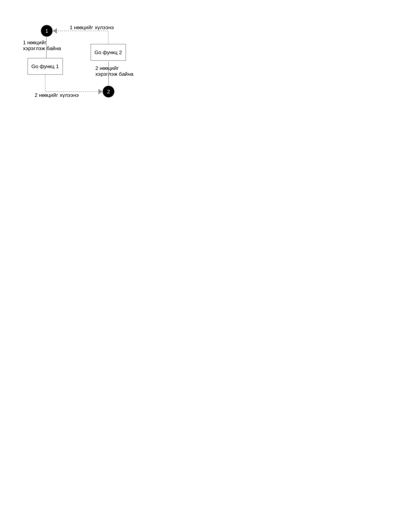

# Өрсөлдөөн илрүүлэх

Зэрэгцээ ажиллах олон go функцүүд тодорхой нөөц, обектыг ашиглахаар хандах үед өрсөлдөөний нөхцөл байдал үүсдэг. Хэрэв go функцүүд нөөцийг нэгэн зэрэг эзэмшилдээ авбал түгжрээ үүсэх ч тохиолдол байдаг.

Дараах зурагт `go функц 1` нь `нөөц 1`-г ашиглаж байна, үүнтэй зэрэг `нөөц 2`-т хандах хэрэгтэй болсон. Гэтэл `нөөц 2`-г `go функц 2` ашиглаж байгаа бөгөөд мөн `нөөц 1`-д хандах шаардлагатай болсон байна. Энэ нөхцөлд _түгжээ_ бий болно.



Өрсөлдөөний нөхцөл бол нууцлаг, илрүүлэхэд төвөгтэй алдааны нэг юм. Хамгийн хэцүү нь ийм алдаа програм үйлдвэрлэлд нэвтэрсэнээс хойш удаан хугацааны дараа илрэх нь элбэг байдаг. Хэдийгээр Go функц нь энгийн, алдаа багатай дүрэмтэй ч гэсэн өрсөлдөөний нөхцөл үүсэхээс хамгаалж чадахгүй. Тиймээс маш анхааралтай, хянамгай байхаас гадна тест, багажууд ашиглах шаардлага гарна.

Go 1.1 хувилбараас эхлэн өрсөлдөөний нөхцөл илрүүлэх шинэ багажтай болсон. Энэ багаж нь C/C++ хэлний `ThreadSanitizer` сан дээр тулгуурласан бөгөөд Google компани дотоодын програмууд болон Chrome/Chromium төсөл дээрээ өргөн ашигладаг юм.

## Яаж ажилладаг вэ

Өрсөлдөөн илрүүлэгч нь командын мөрний `-race` флагаар идэвхжиж ажиллана. Энэ флагыг тавьснаар код санах ой уруу хэрхэн хандаж байгааг ажиглах, улмаар нөөц уруу хяналтгүй зэрэгцээ хандалтуудыг илрүүлэх боломжтой болдог. Өрсөлдөөний нөхцөл үүсмэгц түүнийг дэлгэцэнд хэвлэж мэдээлнэ.

Энэ багаж нь зөвхөн програм ажиллаж байх үед өрсөлдөөний нөхцөлийг илрүүлж чаддаг учраас програмд их хэмжээний ачаалал өгч байж илрүүлөх боломжтой болно. Гэхдээ CPU их ачаалах учраас байнга ажилуулах нь зохимжтой биш. Үүнийг шийдэх нэг арга нь тодорхой тестүүд, тухайлбал зөвхөн ачааллын тест дээр `-race` флагийг идэвхжүүлж болно. Эсвэл бодит орчинд олон процесс ажиллаж байгаа бол аль нэг процесс дээр нь өрсөлдөн илрүүлэгчийг асаагаад орхиж болох юм.

## Хэрэглэх

Өрсөлдөөн илрүүлэгч нь go багажтай хамт ирдэг. Өрсөлдөөний нөхцөл илрүүлэхийн тулд програмаа `-race` флагтай хамт хөрвүүлэхэд болно:

```sh
$ go test -race mypkg     // test the package
$ go run -race mysrc.go     // compile and run the program
$ go build -race mycmd     // build the command
$ go install -race mypkg    // install the package
```

Дараах програмд өрсөлдөөний нөхцөл үүсэхээр байна:

```go
package main
import "fmt"

func main() {
    done := make(chan bool)
    m := make(map[string]string)
    m["name"] = "world"

    go func() {
        m["name"] = "data race"
        done <- true
    }()

    fmt.Println("Hello,", m["name"])
    <-done
}
```

Програмыг `-race` флагтай хөрвүүлээд ажиллуулвал дараах алдааг мэдээлнэ:

```sh
Hello, world
==================
WARNING: DATA RACE
Write by goroutine 3:
  runtime.mapassign1()
      /home/ub/Bin/go/src/pkg/runtime/hashmap.c:1079 +0x0
  main.func·001()
      /home/ub/Dev/src/code.google.com/p/go.blog/support/racy/racy.go:18 +0xa1

Previous read by main goroutine:
  runtime.mapaccess1_faststr()
      /home/ub/Bin/go/src/pkg/runtime/hashmap_fast.c:12 +0x0
  main.main()
      /home/ub/Dev/src/code.google.com/p/go.blog/support/racy/racy.go:21 +0x289

Goroutine 3 (running) created at:
  main.main()
      /home/ub/Dev/src/code.google.com/p/go.blog/support/racy/racy.go:20 +0x18f
==================
Found 1 data race(s)
```

Энэ алдаа нь 1 өрсөлдөөний нөхцөл олдлоо гэдгийг мэдээлж байна. Мөн  програмын `racy.go:18` болон `racy.go:20` мөрүүд дээр өрсөлдөөн үүсэж байна гэдгийг мэдээлж байна.

Үнэхээр go функц ачаалагдсан дариудаа `m` майп уруу `m["name"]="data race"` гэж хандалт хийсэн байна, энэ хооронд үндсэн \(`main`\) функц мөн `m` майпаас уншилт хийж байна.


#  Синхрончлох

Go функцүүдийн нөөцийн төлөө өрсөлдөөнийг зохицуулах хэд хэдэн арга бий.

Нэгдүгээрт суваг ашиглаж болно. Сувгийн зориулалт нь go функцүүдийн хооронд мессеж/өгөгдөл дамжуулах гэдгийг бид мэднэ. Үүнээс өөрөөр мөн go функцүүдийг зохицуулах (синхрончлох) зорилгоор ашиглаж болно. Тухайлбал суваг ашиглан нэг go функцийн ажил дуусахыг хүлээх, дууссан үед нь бусад go функцэд мэдээлдэг байж болно.

```go
func main() {
    // зохицуулагч суваг үүсгэх
    done := make(chan bool, 1)

    // worker функц
    worker:=func worker() {
        fmt.Print("working...")
        time.Sleep(time.Second)

        // ажил дууссан болохыг бусдад мэдээлэх
        done <- true
    }

    // функцийг эхлүүлэх
    go worker()

    // ажил дуусахыг хүлээх
    <-done

    // ... бусад функц ажлаа эхэлж болно
}
```

Энэ жишээний `done` суваг нь өгөгдөл дамжуулах зорилготой биш, зөвхөн ажил дууссан тухай дохио өгөх зорилготой байна.

Зарим тохиолдолд сувгийн оронд зохицуулагч обект ашиглан өгөгдлийн хандалтыг синхрончлох нь оновчтой байдаг. Энэ зорилгоор `sync.Mutex` обектыг ашиглаж болно.

Энэ төрлийн синхрончлолд дундын нөөц рүү тухайн мөчид зөвхөн нэг go функц хандахыг зөвшөөрдөг. Хэрэв тэр нэг go функц нь алдаа гаргавал түгжрэх нөхцөл үүсэж болно гэдгийг анхаарах хэрэгтэй. Тийм учраас өгөгдлийн бүтцээ параллел ажиллагаанд зориулан нарийн зохиомжлох хэрэгтэй.

Дараах жишээнд `AtomicInt` нэртэй бүхэл тоо хадгалах бүтэц үүсгэсэн байна. Энэ бүтцийн `Add`, `Value` методоор дамжуулан түүний бүхэл тоон талбар руу олон go функц  аюулгүй хандах боломжтой.

```go
type AtomicInt struct {
    mu sync.Mutex // хандалтыг зохицуулагч обект
    n  int
}

func (a *AtomicInt) Add(n int) {
    a.mu.Lock() // хандалтыг түгжих, зөвхөн нэг функц зөвшөөрнө​
    a.n += n
    a.mu.Unlock() //  түгжээг тайлах
}

func (a *AtomicInt) Value() int {
    a.mu.Lock()
    n := a.n
    a.mu.Unlock()
    return n
}

func lockItUp() {
    wait := make(chan struct{})
    var n AtomicInt

    go func() {
        n.Add(1) // нэг хандалт
        close(wait)
    }()

    n.Add(1) // өөр нэг зэрэг хандалт
    <-wait

    fmt.Println(n.Value()) // гаралт: 2
}
```
