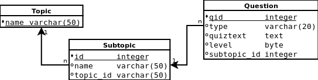

# Бие дааж гүйцэтгэх дасгал

1. 127 ширхэг тэмдэгтийг залгаж test.out файлд бичих програм зохиогоорой. Уг програмаа Linux болон Windows системүүд дээр ажиллуулж үүссэн файлын хэмжээг харьцуулаарай. Файлын хэмжээ Linux дээр 128 байт; харин MS-DOS/Windows дээр 129 байт болно. Яагаад хэмжээ нь ялгаатай байгаа шалтгааныг олоорой.

2. Програмын биелэлтийн үр дүн нь уг програмын текст \(эх код\) байх програм бичээрэй.

3. Өгөгдсөн хавтасын хэмжээг тодорхойлох програм бичээрэй. Хавтасын нийт хэмжээг тооцоолохын тулд бүх дэд хавтасаар орж файлуудын хэмжээг тооцоолох шаардлагатай.

4. Текст файл дахь үгүүдийг өсөх эрэмбээр эрэмбэлэх програм бич.

5. Өгөгдсөн текст файл дахь үгүүд нь  хэдэн удаа давтагдан орсон болохыг тоолж харуулах програм бич.

6. Өгөгдсөн текст файлын агуулгыг W өргөнтэй цонхонд тааруулан тэгшлэх програм бич. Энд үг таслахгүй бөгөөд цонхны өргөнд тааруулах зорилгоор сул зайнууд оруулж болно.

7. Тэмдэгт мөр дэх дараалсан тэмдэгтүүд эсвэл сул зайнуудыг хэчнээн удаа орсон тоогоор нь сольж бичих замаар шахах арга байдаг. Энэ аргаар өгөгдсөн текст файлыг шахах, дараа нь задлах програм бичээрэй.

8. Вигнерийн алгоритм ашиглан ASCII текстийг шифрлэх програм бичээрэй.

9. Өгөгдсөн файлын сүүлийн n мөрийг таслан дэлгэц дээр харуулах tail нэртэй програм бич. Уг програм нь командын мөрнөөс харуулах мөрийн тоо, файлын нэрийг параметр болгон хүлээн авна. Мөрийн тоо заагаагүй тохиолдолд сүүлийн 10 мөрийг харуулна. Ашиглах жишээ:  
   `tail -12 sample.txt`

10. Оюутны дүнгийн мэдээлэл дараах бүтцээр CSV \(Comma Separated Value\) файлд хадгалагдсан байв. Уг файлд оюутны дүнгийн мэдээлэл нэмэх, мэдээлэл хасах, байгаа мэдээллийг засах програм бичээрэй.

    ```csv
    StudentId, FirstName, LastName, Credit, GPA
    SW101001, Батаа, Дорж, 38, 2.26
    SW101007, Цэцгээ, Баатар, 38, 3.10
    ```

11. Дараах өгөгдлийн загварыг ашиглан RDBMS төрлийн бааз үүсгээрэй. Уг бааз дээрээ үндэслэн шалгалт авах програм зохиогоорой.

    

    Энэ програмд дараах функционалиуд нэмж онлайн шалгалтын програм болгон гүйцээгээрэй.

    * дэд сэдэв, асуултууд бүртгэх
    * оюутнууд бүртгэх
    * шалгалт авах
    * шалгалтын дүн бодох

12. Хялбар англи, монгол толь бичгийн програм хийгээрэй.

13. Өөрийн ургийн модыг граф өгөгдлийн санд зохион байгуулаарай. Хадгалах шийдэл нь key-value, document, SQL аль нь ч байж болно. Ургийн модонд хүмүүс “эцэг”, “эх”, “эхнэр”, “нөхөр”, “хүү”, “охин”, “хойт эцэг”, “хойт эх” г.м холбоосуудаар холбогдоно. Эдгээр холбоос дээр үндэслэн өөрийн хамаатнуудыг олох асуулгууд бичээрэй.

    * Үеэлүүдээ олох
    * Нагац ах, эгч нарыг олох
    * Аавын талын хамаатнуудын тоог гаргах

14. Ажилтнуудын ирц бүртгэх програм зохиогоорой. Ирц бүртгэхдээ ажилтны кодын ард “орсон”, “гарсан” командуудыг залгаж орсон, гарсан болохыг бүртгэнэ.  Жнь: “bat ирсэн” гэж бичээд Enter товч дарахад “bat” кодтой ажилтныг ирсэн төлөвт болгож  цагийг мэдээллийн санд бүртгэнэ.

    Өгөгдлийг дараах бүтцээр зохиомжлоно.

    _Ирцийн мэдээлэл_

    | Талбар | Утга |
    | --- | --- |
    | ID | Бичлэгийн дугаар \(автомат дугаарлалттай байна\) |
    | emp\_id | Ажилтны код. Employee хүснэгттэй холбогдсон гадаад түлхүүр. |
    | type | 'ирсэн' эсвэл 'гарсан' утга бичигдэнэ |
    | date | Ирсэн эсвэл гарсан огноо |

    _Ажилтны мэдээлэл_

    | Талбар | Утга |
    | --- | --- |
    | ID | Ажилтны код |
    | first\_name | Ажилтны нэр |
    | last\_name | Эцгийн нэр эсвэл овог |


1. `tcp_server.go`, `tcp_client.go` програмуудыг өргөтгөн дотоод сүлжээний хялбар чаатын програм бичээрэй. Дараа нь програмыг сайжруулан олон хүн зэрэг чаатлах боломжтой болгон өөрчлөөрэй.

2. Цаг агаар мэдээлэх веб үйлчилгээг ашиглан цаг агаарын мэдээ харуулах програм бичээрэй. Жишээ нь, Улаанбаатар хотын цаг агаар харах бол [http://www.google.com/ig/api?weather=ulaanbaatar](http://www.google.com/ig/api?weather=ulaanbaatar) хүсэлтийг илгээнэ. Хариу нь XML бүтэцтэй байх бөгөөд эндээс шаардлагатай мэдээллүүдийг боловсруулж харуулах хэрэгтэй.

3. Хөрөнгийн биржийн сайтаас 10 минут тутамд мэдээлэл шинэчилэн харуулах програм бичээрэй.

4. 9999 порт дээр ажилладаг дараах үүрэг бүхий веб програм бичээрэй:

   a\) [http://localhost:9999/hello/Name](http://localhost:9999/hello/Name) гэж хүсэлт илгээхэд “hello Name” гэж хариулна. Үүнд `Name` хэсэг нь өөрчлөгдөнө

   b\) [http://localhost:9999/shouthello/Name](http://localhost:9999/shouthello/Name) гэж хүсэлт илгээхэд “hello NAME“ гэж хариулна. Ө.х нэрийг томоор бичиж хариулна.

5. Дараах командуудыг дэмжин ажиллах хялбар FTP сервер програм бичээрэй.

   * `dir` - сервер дээрх файл, хавтасын жагсаалт харах
   * `get <алсын файл>` - серверээс заасан файлыг татах
   * `put <локаль файл>` - сервер рүү заасан файлыг хуулах

6. Ажилтнуудын ирц бүртгэх вэб програм зохиогоорой. Дэлгэцийн дүрслэл дараах байдалтай харагдана. Ажилтнуудын нэрс бүхий товчлуур дээр дарахад ирцийг \(нэр, цаг минут\) серверээр дамжуулан өгөгдлийн сан уруу бүртгэнэ. Ингэхдээ ажилтан ирсэн төлөвтэй үед дарвал гарсан төлөвт, гарсан бол ирсэн төлөвт солино. \(Жич: өгөгдлийн сантай ажиллах бүлэгт үзсэн жишээг ашиглаж болно\)

7. Дээрх файл серверийн програмыг нэг файлыг олон хувааж олон сувгаар \(сүлжээгээр\) зэрэг дамжуулах чадвартай  болгон сайжруулаарай.

8. Монгол банкны сайтаас цаг тутамд ханшийн мэдээлэл татаж харуулах програм бичээрэй.

9. Зурган өгөгдлийг олон жижиг хэсгүүдэд хуваан клиент руу зэрэг дамжуулах чадвартай сервер програм зохиогоорой.

10. Bitly, gog.gl гэх мэт урт интернэт хаягийг товчхон болгодог интернэтийн сайтууд байдаг. Үүнтэй төстэй URL товчлох хялбар вэб сервер үүсгээрэй.
