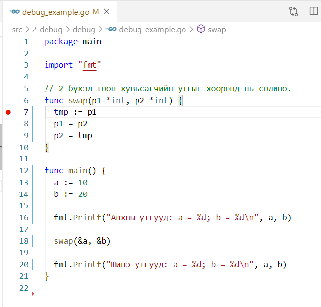
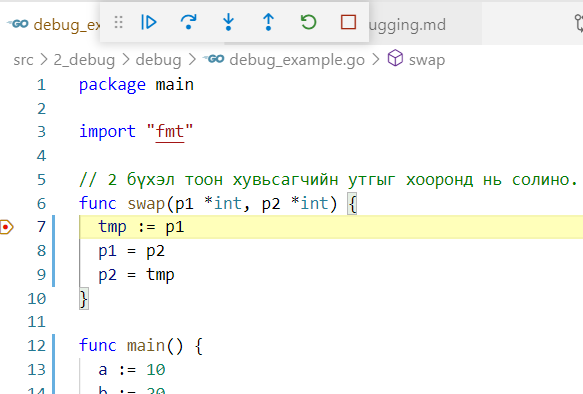

# Дебааг хийх

Ихэнхи бааг зүгээр эх код дээр нь ажиглалт хийгээд илрэхээргүй байдаг. Тиймээс тусгай дебааг хийх багажийг ашиглах хэрэгтэй.

Дебааг хийгч багаж нь програмыг тусгай орчинд ачаалан, ажиллагаан дээр нь хяналт тавьж чаддаг. Жишээлбэл, програмын заавруудыг алхам алхамаар нь биелүүлэх, биелэлтийг зогсоож хувьсагчийн утгыг унших, функцийн дуудалтыг шинжлэх, санах ойн байрлал, програмын төлөв, хувьсагчийн өөрчлөлтийг ажиглах, харах боломжтой байдаг.

Хамгийн түгээмэл хэрэглэгддэг дебааг хийгч багаж бол GNU debugger буюу GDB гэж нэрлэгдэх багаж юм. GDB нь C, C++ програмыг дебааг хийх зориулалттай боловч Go програмыг дебааг хийхэд мөн ашиглаж болно. Гэхдээ GDB нь зарим Go хэлний онцлогтой хэсгийг дебааг хийж чаддаггүй.

Go хэлэнд зориулсан Delve нэртэй дебааг хийх багаж бий. Энэ багажийг дараах командаар татаж суулгаж болно.

```sh
$ go install github.com/go-delve/delve/cmd/dlv@latest
```

Жишээ болгон дараах логикийн алдаатай програмыг VS Code дээр Delve багажаар шинжлэе.

```go
package main
import "fmt"

// 2 бүхэл тоон хувьсагчийн утгыг хооронд нь солино.
func swap(p1 *int, p2 *int) {
  tmp := p1
  p1 = p2
  p2 = tmp
}

func main( ) {
 a:=10 ; b:=20

 fmt.Printf( "Анхны утгууд: a = %d; b = %d\n", a, b )
 swap( &a, &b )
 fmt.Printf( "Шинэ утгууд: a = %d; b = %d\n", a, b )
}
```

Програмыг ажиллуулвал дараах мэдээллийг дэлгэцэнд гаргана:

```sh
Анхны утгууд: a = 10; b = 20
Шинэ утгууд: a = 10; b = 20
```

Энд `swap()` функцийг дуудсан боловч `a` болон `b` хувьсагчдын утга солигдоогүй байна. Үүний шалтгааныг дебааг хийж олоё. 

Дебааг хийхийн тулд програмын ажиллагааг ямар цэг дээр зогсоохыг хэлэх хэрэгтэй. Энэ цэгийг зогсолтын цэг (breakpoint) гэж нэрлэдэг. Програмын биелэлт зогсолтын цэг дээр ирэхэд ажиллагааг нь таслаж тухайн цэг дээр програмыг шинжлэх боломжийг олгодог. Зогссон цэгээс цааш үргэлжлүүлэн програмын заавруудыг нэг нэгээр нь ажиллуулж шинжлэх боломжтой болно.

Зогсолтын цэгийг заахын тулд `Add breakpoint` цэс ашиглах эсвэл мөрийн дугаарын өмнө хулганаар дарахад улаан цэг үүсэх болно. 

Бид `swap( )` функц дотор алдаа байгаа гэж таамаглаж байгаа учраас эх кодын 7-р мөр буюу  утгуудыг хооронд нь сольж байгаа мөр дээр програмыг зогсоохоор тохируулая.



Дебаггер нь програмыг санах ойд ачаалах боловч ажиллуулалгүй хүлээлтийн төлөвт оруулдаг. Энэ нь таныг ямар заавар өгөхийг хүлээж байгаа хэрэг юм.

Энэ цэгээс цааш алхам алхамаар шинжлэх болно. Үүний тулд `step over буюу F10` эсвэл `step into буюу F11` командыг сонгоно. `step over` нь мөрийг биелүүлээд програмын ажиллагааг дараагийн мөр дээр зогсооно. `step into` нь өөр функц дотор орж шинжлэхэд хэрэглэгдэнэ, энэ үед одоогийн функцийн ажиллагаа түр зогсож дараагийн функцийн эхний мөр рүү биелэлтийг шилжүүлдэг.


Бидний жишээнд 7-р мөрөөс хойш энгийн командууд байгаа учраас `step over` командыг ашиглана. Энэ цэгт функцэд дамжуулсан утгуудыг жишээлбэл шалгаж болно. Үүний тулд хувьсагчийн нэр дээр хулганаа байрлуулна.



`p1`, `p2` параметрүүд харгалзан 10, 20 утгатай байна. Хэрэв цааш үргэлжлүүлэн харвал `p1` ба `p2` заагчдын хаягууд солигдсон, харин тэдгээрийн зааж байгаа санах ойн байрлал дахь утгууд (`a` ба `b`) солигдоогүй болохыг харж болно. Тэгэхлээр `swap()` функц дотор заагчийн алдаа байсан байна, ө.х заагчдын өмнө `*` орхигдсон байна. Функц дотор `p1` ба `p2` утгуудыг хооронд нь солихоор засах хэрэгтэй:

```go
func swap( p1 *int, p2 *int) {
   tmp := *p1
   *p1 = *p2
   *p2 = tmp
}
```

Ингээд алдаагаа олсон учраас дебаггер багажийг зогсоож болно. Үүний тулд `stop буюу shift+F5` командыг өгөх хэрэгтэй.